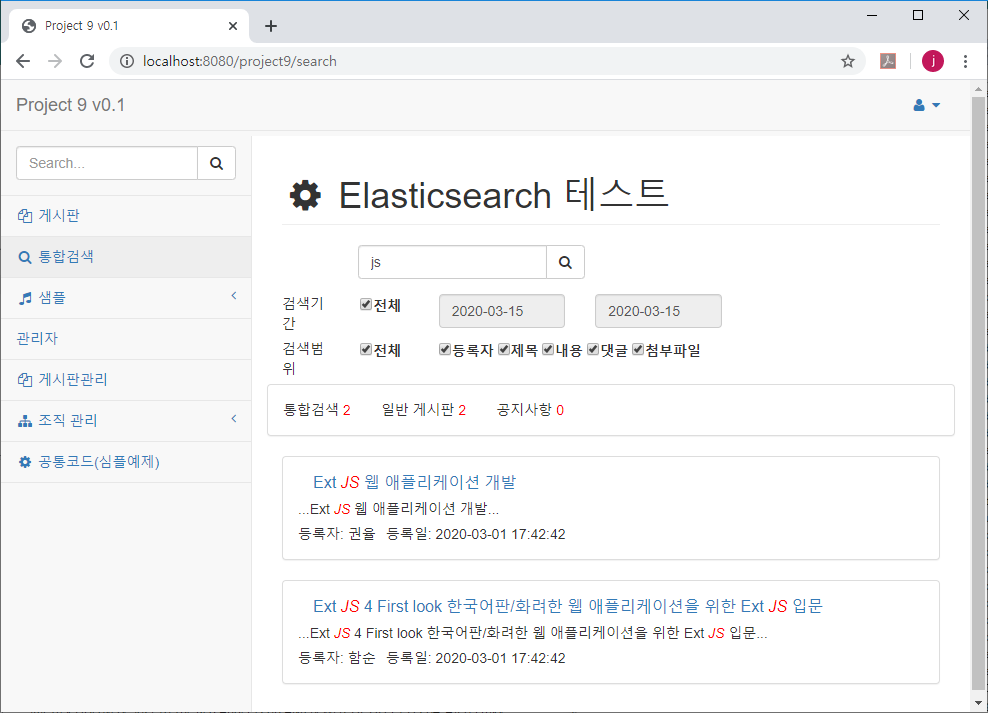

## Elasticsearch 예제 ##
본 샘플은  검색엔진 Elasticsearch용 예제로,

Spring 4 + MyBatis 3 + MariaDB (Maven) 기반으로  제작한 웹 프로젝트 [Project9](https://github.com/gujc71/project9)에 검색 기능을 추가하여 제작하였다.

좀더 자세한 설명은 [여기](https://forest71.tistory.com/207)에서 확인할 수 있다.

### 주요 구현 기능 ###
- 게시판 데이터 수집: 게시글, 댓글, 첨부 파일(Tika)
- 웹 프로젝트에서 통합 검색

### 비슷한 예제  ###
- [Solr 기반 게시판 예제](https://github.com/gujc71/Project9_Solr)

### 개발 환경 ###
    Search Engine - Elasticsearch 7.6.1
    Programming Language - Java 1.8
    IDE - Eclipse
    DB - MariaDB 
    Framework - MyBatis, Spring 4
    Build Tool - Maven

### Elasticsearch 설치 ###
- [Elasticsearch](https://www.elastic.co/kr/downloads/elasticsearch) 다운로드 후 압축 해제(설치)  
- 실행: bin/elasticsearch.sh or bin/elasticsearch.bat 
- 형태소 분석기 설치: bin/elasticsearch-plugin install analysis-nori
- 사전 복사: copy dictionary files in project9_es/elasticsearch (userdict.txt, stopwords.txt, synonyms.txt)
- 재실행

### Project9 설치 ###
- MariaDB에 데이터 베이스(project9)를 생성하고 tables.sql, tableData.sql를 실행하여 테이블과 데이터를 생성한다.
- applicationContext.xml에 적절한 접속 정보를 입력한다.

- 콘솔창에서(cmd) project9_es 폴더로 이동: cd YOUR_WORKSPACE\project9_es
- 색인(index) 생성: curl -XPUT localhost:9200/project9 -d @index_board.json -H "Content-Type: application/json"

- 톰캣(Tomcat9)이나 이클립스에서 project9 실행 
- http://localhost:8080/project9/로 접속
- ID/PW: admin/admin, user1/user1, user2/user2 ...

### License ###
MIT
  
  